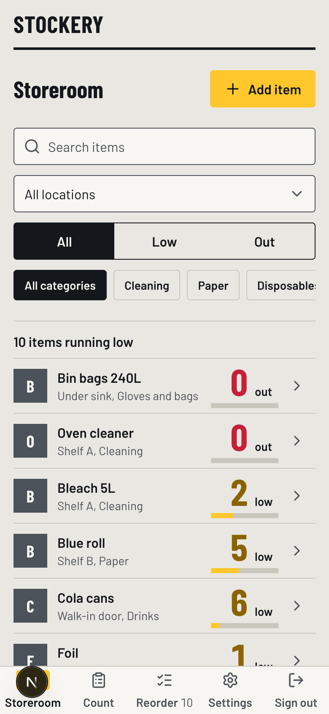
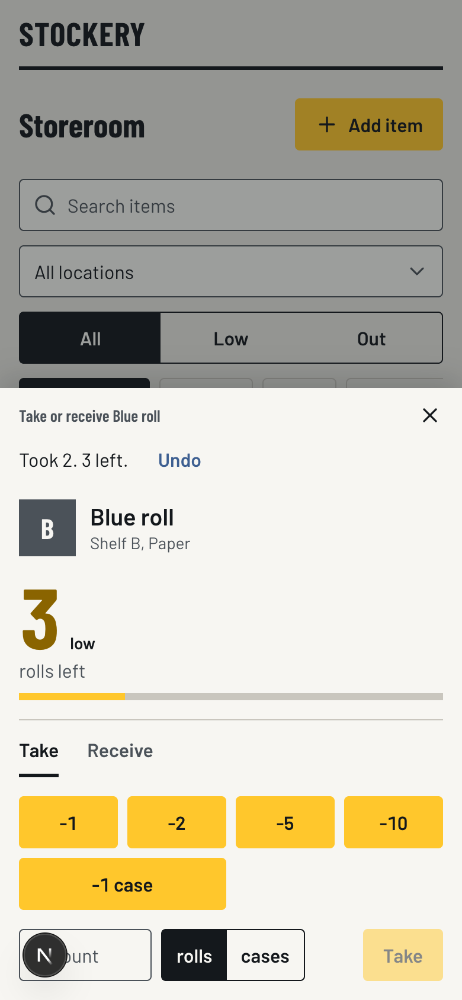
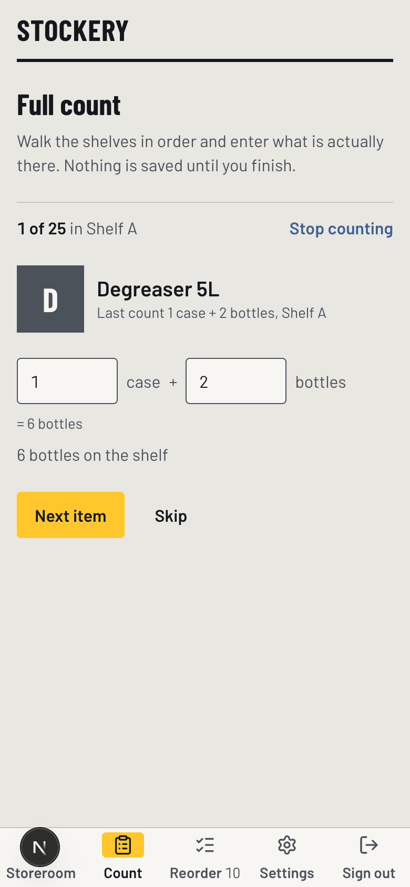

# Stockery

Storeroom stock for a working kitchen. Stockery tracks every item in a commercial kitchen's dry-goods storeroom, warns when anything is running low against a threshold you set per item, and makes the thing you do twenty times a day, "I just took 5 of these", a single tap from a phone while you are standing in front of the shelf. Once in a while you walk the shelves and enter what is really there; anything low turns up on a shopping list by itself.





## The stack, and why

| Choice | Reason |
|---|---|
| Next.js (App Router, TypeScript) | One app for the screens and the API, so Render runs a single free web service with nothing else to keep awake. |
| Route handlers under `src/app/api` | Every mutation goes through an inspectable, testable HTTP endpoint. Pages read through Prisma directly. |
| Prisma 7 with `@prisma/adapter-pg` | Typed queries and checked-in migrations, talking to Postgres over the plain `pg` driver. |
| Postgres on Neon | A free tier that does not expire, unlike Render's own free Postgres. |
| next-auth v5, Credentials provider | One admin, whose username and bcrypt hash live in environment variables. There is no user table to manage. |
| Tailwind CSS v4 with an `@theme` block | Every colour, size, rule and duration is a token in `globals.css`. No component carries a raw hex value. |
| shadcn on Base UI primitives | Accessible behaviour for dialogs, checkboxes and switches, restyled through the tokens so nothing reads as stock shadcn. |
| Images as `Bytes` in Postgres | Photos are resized to 512px JPEG in the browser before upload, so they are tens of kilobytes. No object storage to pay for or configure. |
| Zod | Every request body and query string is validated at the edge of the API. |
| Vitest | Unit tests for the stock maths: status, pack conversion, clamping, undo windows. |

## Running it locally

1. **Get a database.** Create a free project at [neon.tech](https://neon.tech) and copy the Prisma connection string. Any local Postgres works too.
2. **Set the environment.** Copy `.env.example` to `.env` and fill it in:
   - `DATABASE_URL` from Neon.
   - `AUTH_SECRET`: any long random string, for example `openssl rand -base64 32`.
   - `ADMIN_USERNAME`: whatever you want to type at the login screen.
   - `ADMIN_PASSWORD_HASH`: run `node scripts/hash-password.mjs "your password"` and paste the escaped line it prints. Every `$` must be escaped as `\$` in a local `.env` file; the script prints that form for you.
3. **Install and migrate.**
   ```
   npm install
   npx prisma migrate dev
   npm run db:seed      # 25 realistic items, several of them low or out
   npm run dev
   ```
4. Open http://localhost:3000 and sign in.

Useful scripts: `npm run lint`, `npm run typecheck`, `npm test`, `npm run db:migrate`, `npm run db:seed`, `npm run hash-password`.

## Deploying to Render

1. Push the repository to GitHub.
2. In Render, choose **New > Blueprint** and point it at the repository. `render.yaml` declares one free Node web service that installs, generates the Prisma client, applies migrations, and builds.
3. Set the four secret environment variables in the Render dashboard: `DATABASE_URL`, `AUTH_SECRET`, `ADMIN_USERNAME`, `ADMIN_PASSWORD_HASH`. Paste the **raw** hash here, not the escaped form.
4. Deploy, then open the URL on a phone and sign in.

The free instance sleeps when idle, so the first request after a quiet spell takes a few seconds.

## Design notes

The visual direction is **Receiving Dock**: warehouse aisle signage, delivery-bay stencils, the black-on-yellow bay numbers at a loading dock. One element carries the whole design, the quantity numeral, set in Barlow Condensed at 44px in a list row and 72px in the take sheet so it is readable at arm's length in a dim storeroom. Everything else stays quiet. Safety yellow means exactly two things, the primary action and low stock, and appears nowhere else. Heavy rules separate shelf groups because they encode "new shelf"; hairlines separate rows. Nothing rounds past 4px.

The full reasoning, the palette with its contrast checks, the type scale, the layout wireframes, and the list of decisions taken from the frontend-design skill are in [docs/design-plan.md](docs/design-plan.md). Every phase of the build was screenshotted at 1440×900 and 390×844 and critiqued against that plan before being committed; those entries are in [docs/critique-log.md](docs/critique-log.md), and the screenshots are in [docs/screens](docs/screens).

Stock status is told three ways at once, so it survives both colourblindness and a dark room: the numeral's colour, a bar showing quantity against the threshold, and a plain word, "low" or "out". An item that is fine says nothing at all.
